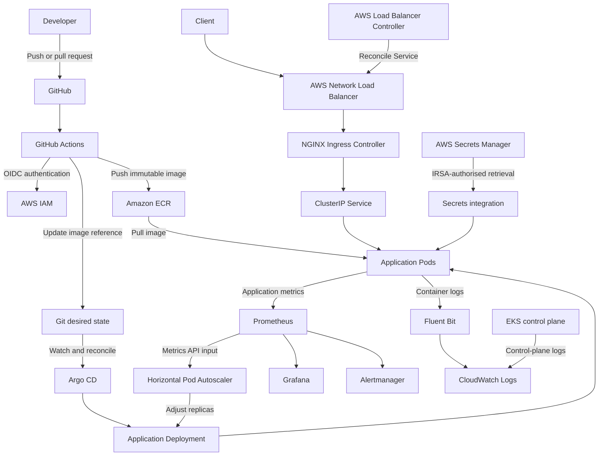
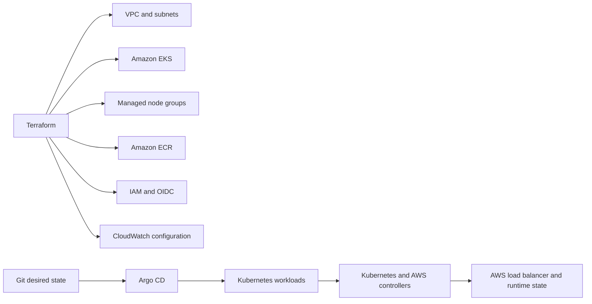

# Platform Architecture

## Delivery and runtime architecture

## Infrastructure ownership

## Boundary notes

- Terraform does not manage application Pods directly.
- GitHub Actions produces artifacts but is not the normal cluster deployment
  authority.
- Argo CD reconciles Kubernetes desired state but does not replace Terraform as
  the owner of foundational AWS infrastructure.
- The AWS Load Balancer Controller owns load balancers that are generated from
  Kubernetes resources.
- Prometheus metrics and CloudWatch logs have complementary operational roles.

